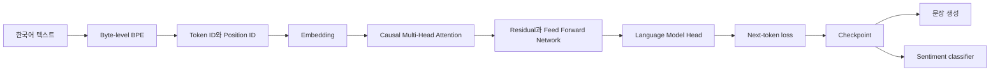
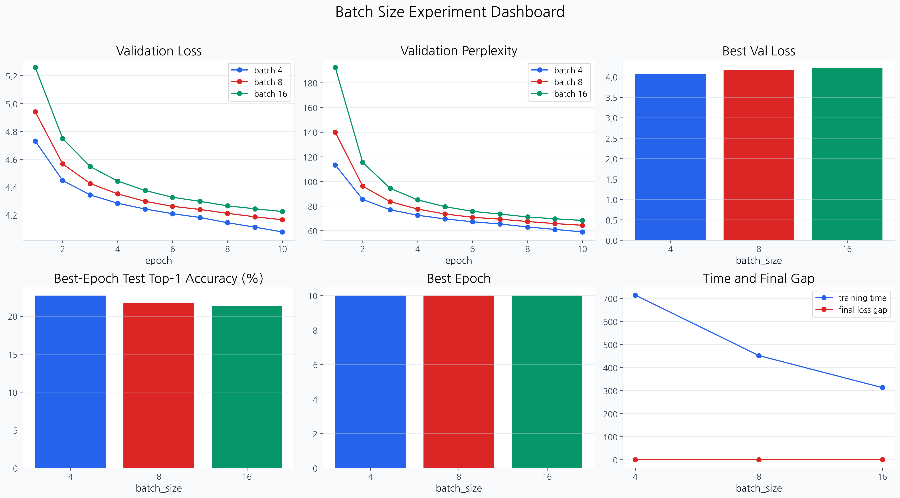

# LLM From Scratch Lab

한국어 텍스트를 토큰으로 나누는 단계부터 다음 토큰 예측, checkpoint와 문장 생성까지 연결한 교육용 소형 GPT입니다.

`Python` `PyTorch` `NumPy` `4인 팀 공동 구현`

[구현 구조](docs/architecture.md) | [실험 결과](docs/results.md) | [기여 기록](docs/contribution-map.md) | [출처와 재사용 범위](ATTRIBUTION.md)

## 시작한 이유

LLM API를 사용하는 것만으로는 모델 안에서 데이터가 어떻게 흐르는지 알기 어려웠습니다. 텍스트가 token ID가 되는 과정, attention이 미래 토큰을 가리는 이유, 학습한 모델이 다음 토큰을 고르는 과정을 코드로 직접 연결해 보고 싶었습니다.

먼저 NumPy로 layer의 forward와 backward, optimizer를 구현했습니다. 그다음 byte-level BPE, embedding, causal multi-head attention, Transformer block, 사전학습, 생성과 sentiment fine-tuning 도구까지 범위를 넓혔습니다.

## 구현 흐름



| 단계 | 구현 내용 | 위치 |
| --- | --- | --- |
| 신경망 기초 | Affine, ReLU, Softmax, BatchNorm, Dropout, cross entropy, SGD, Adam | `foundations/mnist_numpy/` |
| Tokenization | byte-level BPE 학습, encode와 decode | `gpt/src/bpe.py` |
| Embedding과 Attention | token과 position embedding, causal multi-head attention | `gpt/src/embeddings.py`, `gpt/src/attention.py` |
| GPT | LayerNorm, residual path, FFN, Transformer block와 LM head | `gpt/src/model.py` |
| 학습과 생성 | loss, optimizer step, checkpoint, temperature와 top-k generation | `gpt/src/train.py` |
| Fine-tuning | sentiment dataset, classifier head, train과 evaluate 도구 | `gpt/src/finetune.py` |

NumPy array만으로 layer cache와 gradient, SGD와 Adam을 계산했습니다. 이어서 PyTorch `nn.Module` 경계와 tensor shape를 직접 설계해 GPT 학습과 생성을 연결했습니다.

학습 code 밖에서는 pytest로 수치와 상태 전이를 검사하고, smoke run과 batch 실험을 JSON, CSV, Markdown과 그래프로 남깁니다. NumPy gradient, PyTorch module, pytest와 산출물을 함께 보면 구현과 검증의 연결을 추적할 수 있습니다.

세부 tensor shape와 module boundary는 [구현 구조](docs/architecture.md)에 정리했습니다.

## 팀 결과와 개인 기여

원본 과제는 4명이 페어 프로그래밍으로 진행했습니다. BPE, embedding, attention과 GPT backbone은 팀 공동 구현입니다.

- GPT 원본: [`Soldbone/gpt-lab`](https://github.com/Soldbone/gpt-lab)
- NumPy와 MNIST 원본: [`devhyun05/group4-mnist-lab`](https://github.com/devhyun05/group4-mnist-lab)

이 저장소는 두 과제의 코드와 근거 자료를 이시원이 개인 검증용으로 다시 구성한 저장소입니다. Git author로 확인되는 개인 범위는 다음과 같습니다.

| 범위 | 확인되는 작업 |
| --- | --- |
| NumPy 기초 | ReLU, Softmax, Affine, loss, SGD, Adam, Dropout, BatchNorm과 network composition |
| GPT 학습 | batch loss, pretraining loop, checkpoint 저장과 복원 |
| 생성 | temperature와 top-k token generation, encode에서 decode까지의 sample 흐름 |
| Fine-tuning | sentiment dataset, classifier, train과 evaluate 도구 |
| 증적 | batch-size 실험과 독립 저장소 재현 자료 보존 |

개별 commit과 공동 구현 경계는 [기여 기록](docs/contribution-map.md)에서 확인할 수 있습니다.

## GPT 파라미터 실험과 시각자료

### GPT 설정 비교의 판단 순서

기준 실행은 2 layers, learning rate 3e-4, batch size 8, dropout 0.1이었습니다. 이 기준에서 표현력, 최적화 속도, 한 번에 처리하는 표본 수, 규제 강도를 각각 바꾸어 볼 필요가 있었습니다.

층 수는 표현력과 계산량의 균형을, learning rate는 주어진 epoch 안의 최적화 속도를 확인하려고 비교했습니다. batch size는 loss와 학습 시간의 trade-off를, dropout은 작은 모델에서의 규제 강도를 보기 위한 항목이었습니다.

layer, learning rate, dropout 비교는 발표 표와 그래프만 보존되어 있습니다. batch 4, 8, 16 비교에는 `4fe533e`의 설정 JSON, epoch metric, summary와 dashboard가 남아 있어 원본 수치를 다시 읽을 수 있습니다.

시도한 범위의 최저 validation loss와 batch 4의 raw artifact를 바탕으로 6 layers, 5e-4, batch 4, dropout 0.1을 최종 설정으로 기록했습니다. 이는 이 자료에서의 선택 순서이며 보편적인 최적값 주장이 아닙니다.

초기 실행과 최종 실행에서는 layer, learning rate와 batch size가 함께 달라졌습니다. 따라서 최종 loss의 차이를 한 파라미터가 만든 효과로 해석하지 않습니다.

| 파라미터 | 비교값 | 관찰한 결과 | 근거 |
| --- | --- | --- | --- |
| Transformer layers | 2, 4, 6 | 6층 validation loss 3.995 | 발표 표와 그래프 |
| Learning rate | 1e-4, 3e-4, 5e-4 | 5e-4 validation loss 4.0297 | 발표 표와 그래프 |
| Batch size | 4, 8, 16 | batch 4가 가장 낮은 loss, batch 16이 가장 빠름 | raw metric과 dashboard |
| Dropout | 0.1, 0.2, 0.3 | 0.1 best validation loss 5.699 | 발표 표와 그래프 |

### Transformer 층 수

층을 늘리면 더 복잡한 표현을 학습할 수 있지만 계산량과 memory도 늘어납니다. 이 모델과 corpus에서는 2층 4.160, 4층 4.067, 6층 3.995 순으로 마지막 validation loss가 낮아졌습니다.


### Learning rate

1e-4, 3e-4, 5e-4를 10 epoch 동안 비교했습니다. 시도한 범위에서는 5e-4가 4.0297로 가장 낮았지만, 더 큰 learning rate에서도 같은 경향이 이어진다는 뜻은 아닙니다.


### Batch size

batch 4, 8, 16은 seed 42, 같은 corpus와 model 설정으로 실행했습니다. batch 4는 best validation loss 4.077299, batch 16은 전체 학습 시간 312.575초를 기록해 품질과 시간의 trade-off가 드러났습니다.




이 비교에는 batch별 JSON, summary와 epoch metric이 남아 있습니다. 단일 seed와 단일 GPU 실행이므로 일반적인 최적 batch size로 해석하지 않습니다.

### Dropout

dropout을 높이면 과적합을 줄일 수 있지만 작은 모델에서는 필요한 표현까지 막을 수 있다고 예상했습니다. 이 기록에서는 0.1, 0.2, 0.3 순으로 best validation loss가 5.699, 5.793, 5.900이었습니다.


### 최종 설정

| 항목 | 값 |
| --- | ---: |
| Transformer layers | 6 |
| attention heads | 4 |
| learning rate | 5e-4 |
| batch size | 4 |
| dropout | 0.1 |
| epochs | 10 |

최종 실행은 train loss 3.653, validation loss 3.769를 기록했습니다. 초기 실행과 여러 설정이 함께 달라졌으므로 개선 폭을 한 파라미터의 효과로 돌리지 않습니다.


전체 수치, artifact link와 해석 한계는 [실험 결과](docs/results.md)에 있습니다.

## 현재 재현 방법

과거 batch 결과는 CUDA 장치에서 남긴 학습 증적이고, 현재 확인은 CPU smoke입니다. 데이터, 모델 크기와 목적이 달라 현재 CPU 실행으로 과거 GPU 수치를 재현했다고 주장하지 않습니다.

```bash
uv sync
uv run pytest -q
uv run python scripts/smoke_train.py --output artifacts/current/smoke-result.json
```

2026-08-22 baseline에서 54개 테스트가 통과했습니다. Matplotlib의 non-interactive canvas 경고 2개가 있었지만 실패는 없었습니다.

CPU smoke는 하나의 synthetic batch를 5 step 반복합니다. loss 감소는 optimizer 연결을 확인할 뿐 모델 품질이나 일반화 성능을 증명하지 않습니다.

`scripts/smoke_train.py`는 seed 42와 작은 model 설정을 고정하고 initial loss, final loss와 step별 loss를 JSON으로 저장합니다. `tests/test_evidence_contract.py`는 historical GPU와 current CPU 구분, batch commit `4fe533e` 표기를 검사합니다.

같은 날 smoke를 다시 실행한 결과 날짜를 제외한 field와 loss 값이 보존 JSON과 일치했습니다. script가 실행일을 `run_date`에 기록하므로 기존 증적 파일은 바꾸지 않았습니다.

## 프로젝트 구조

```text
.
├── foundations/mnist_numpy/  # NumPy 신경망 기초
├── gpt/                      # BPE, GPT, 학습과 fine-tuning
├── scripts/smoke_train.py    # CPU 연결 검사
├── artifacts/current/        # 현재 smoke 결과
├── artifacts/pretraining/    # 원본 batch 실험
└── docs/                     # 구조, 결과와 기여 근거
```

## 한계와 출처

- 교육용 소형 GPT이며 범용 언어 모델의 품질을 목표로 하지 않습니다.
- layer, learning rate, dropout과 최종 실행에는 원본 지표 파일이 없습니다.
- batch 비교는 단일 seed와 단일 장비에서 실행했습니다.
- sample generation 표에는 encoding이 깨진 문자열이 있어 생성 품질 근거로 쓰지 않습니다.
- fine-tuning 코드와 단위 테스트는 있지만 검증 가능한 accuracy 산출물은 없습니다.
- 원본 팀 코드와 공개 동의, 재사용 범위는 [ATTRIBUTION.md](ATTRIBUTION.md)를 따릅니다.
