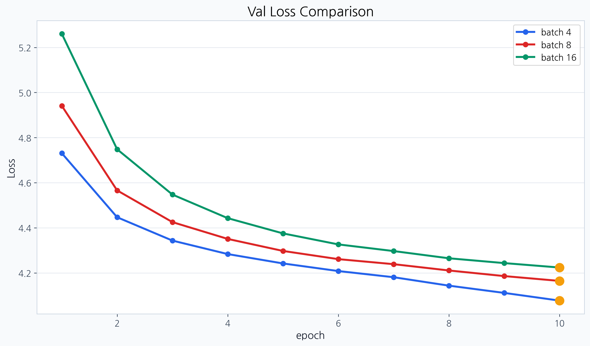

# LLM From Scratch Lab

한국어 텍스트를 토큰으로 나누는 단계부터 다음 토큰 예측 학습과 문장 생성까지 연결한 교육용 소형 GPT입니다.

`Python` `PyTorch` `NumPy` `4인 팀 공동 구현`

[구현 구조](docs/architecture.md) | [실험 결과와 검증 범위](docs/results.md) | [기여 기록](docs/contribution-map.md) | [출처와 재사용 범위](ATTRIBUTION.md)

## 프로젝트를 시작한 이유

LLM API를 사용하는 것과 모델 안에서 데이터가 흐르는 과정을 이해하는 것은 다른 문제였습니다. 문장이 어떻게 token ID가 되고, attention이 왜 미래 token을 가려야 하며, 학습한 모델이 어떤 과정을 거쳐 다음 token을 고르는지 코드로 직접 연결해 보고 싶었습니다.

처음에는 NumPy만 사용해 신경망의 forward와 backward, optimizer를 구현했습니다. 그다음 byte-level BPE부터 embedding, causal multi-head attention, Transformer block, 사전학습과 문장 생성까지 범위를 넓혔습니다.

## 팀에서 어떻게 만들었나

4명이 기능을 개인 결과물처럼 나눠 끝내지 않고 페어 프로그래밍으로 전 과정을 함께 구현하고 검증했습니다. BPE, embedding, attention과 GPT backbone은 팀 공동 구현이며 특정 한 사람의 단독 결과로 표시하지 않습니다.

이 저장소는 두 팀 과제의 학습 흐름을 한곳에서 다시 확인할 수 있게 이시원이 개인 검증용으로 재구성한 저장소입니다. 원본 공동 저장소는 그대로 유지했습니다.

- GPT 원본: [`Soldbone/gpt-lab`](https://github.com/Soldbone/gpt-lab)
- NumPy와 MNIST 원본: [`devhyun05/group4-mnist-lab`](https://github.com/devhyun05/group4-mnist-lab)

팀 전체 구현과 이시원이 작성한 commit의 경계는 [기여 기록](docs/contribution-map.md)에 따로 남겼습니다.

## 구현한 흐름

```text
한국어 text
  -> byte-level BPE 학습과 encode
  -> token ID와 position ID
  -> token embedding과 position embedding
  -> causal multi-head attention
  -> residual Transformer blocks
  -> language-model head
  -> next-token cross entropy
  -> checkpoint
  -> 문장 생성 또는 감성 분류 fine-tuning utility
```

| 단계 | 구현 내용 | 위치 |
|---|---|---|
| 신경망 기초 | Affine, ReLU, Softmax, BatchNorm, Dropout, cross entropy, SGD, Adam | `foundations/mnist_numpy/` |
| Tokenization | byte-level BPE 학습, encode와 decode, vocabulary와 merge rule | `gpt/src/bpe.py` |
| Embedding과 Attention | token과 position embedding, causal multi-head attention | `gpt/src/embeddings.py`, `gpt/src/attention.py` |
| GPT | LayerNorm, residual path, FFN, Transformer block, LM head | `gpt/src/model.py` |
| 학습과 생성 | loss, optimizer step, checkpoint, temperature와 top-k 생성 | `gpt/src/train.py` |
| Fine-tuning | 감성 데이터셋, 분류 head, 학습과 평가 utility | `gpt/src/finetune.py` |

## 학습 조건을 비교한 방법

모델을 한 번 완성한 뒤에는 값을 무작정 바꾸기보다 먼저 결과를 예상하고 확인했습니다. 층 수, 학습률, 배치 크기와 dropout을 바꾸면 학습 곡선이 어떻게 달라질지 가설을 세우고, 가능한 범위에서는 다른 조건을 고정해 비교했습니다.

발표 당시 기준 설정은 다음과 같습니다.

| 항목 | 값 |
|---|---:|
| vocabulary | 3,000 |
| context length | 128 |
| embedding dimension | 128 |
| Transformer layers | 2 |
| attention heads | 4 |
| learning rate | 3e-4 |
| batch size | 8 |
| dropout | 0.1 |
| epochs | 10 |

이 기준 실행은 마지막 epoch에서 train loss 5.278, validation loss 5.565, test loss 5.563을 기록했습니다.

### 층 수

층을 늘리면 더 복잡한 표현을 학습할 수 있지만 학습 시간과 메모리 사용량도 늘어난다고 예상했습니다.

| Layers | 마지막 validation loss |
|---:|---:|
| 2 | 4.160 |
| 4 | 4.067 |
| 6 | 3.995 |

이 비교에서는 6층의 validation loss가 가장 낮았습니다. 다만 층이 많을수록 항상 좋은 모델이 된다고 일반화하지 않고, 이번 모델과 데이터 범위에서 확인한 결과로만 해석했습니다.

### 학습률

작은 모델에서는 학습률을 조금 높여도 안정적으로 수렴할 수 있다고 예상했습니다.

| Learning rate | 마지막 validation loss |
|---:|---:|
| 1e-4 | 4.4031 |
| 3e-4 | 4.1608 |
| 5e-4 | 4.0297 |

시도한 범위에서는 5e-4가 가장 낮았습니다. 더 큰 학습률에서도 같은 경향이 이어진다는 뜻은 아닙니다.

### 배치 크기

작은 배치는 step별 gradient 추정의 흔들림이 커질 수 있고, 큰 배치는 더 안정적인 대신 한 번의 update에 더 많은 계산이 필요합니다. 원본 commit `4fe533e`에 보존된 같은 seed와 같은 corpus의 비교 결과는 다음과 같습니다.

| Batch size | Best validation loss | Test perplexity | 전체 학습 시간 |
|---:|---:|---:|---:|
| 4 | 4.0773 | 59.3438 | 714.12초 |
| 8 | 4.1646 | 64.9118 | 451.79초 |
| 16 | 4.2240 | 68.9680 | 312.58초 |

이 실행에서는 batch 4가 가장 낮은 validation loss를 보였고 batch 16이 가장 빨리 끝났습니다. 학습 품질과 시간 사이의 trade-off로 보았으며, 단일 seed 결과를 일반적인 최적 batch size로 해석하지 않았습니다.



### Dropout

dropout을 늘리면 과적합을 줄일 수 있지만 작은 모델에서는 필요한 표현까지 막아 underfitting이 커질 수 있다고 예상했습니다.

| Dropout | Best validation loss |
|---:|---:|
| 0.1 | 5.699 |
| 0.2 | 5.793 |
| 0.3 | 5.900 |

이 비교에서는 dropout을 높일수록 train과 validation loss가 함께 올라 0.1을 유지했습니다.

## 최종 설정과 결과

각 비교에서 확인한 방향을 바탕으로 다음 설정을 선택했습니다.

| 항목 | 최종 값 |
|---|---:|
| vocabulary | 3,000 |
| context length | 128 |
| embedding dimension | 128 |
| Transformer layers | 6 |
| attention heads | 4 |
| learning rate | 5e-4 |
| batch size | 4 |
| dropout | 0.1 |
| epochs | 10 |

최종 실행은 train loss 3.653, validation loss 3.769를 기록했습니다. 발표의 초기 실행과 비교하면 validation loss가 5.565에서 3.769로 낮아졌습니다.

층 수, 학습률과 배치 크기를 함께 바꾼 결과이므로 이 차이를 특정 설정 하나의 효과로 해석하지 않습니다. 발표 자료의 초기와 최종 결과, 저장소에 보존한 batch-size 실험도 서로 다른 실행이므로 하나의 연속된 loss curve처럼 합치지 않았습니다.

## 현재 저장소에서 다시 확인할 수 있는 것

발표 당시 GPU 실험 전체를 다시 실행하는 대신, 현재 환경에서는 다음 세 범위를 분리해 검증합니다.

1. NumPy layer와 optimizer의 forward, backward 동작
2. BPE, attention, GPT, 학습과 fine-tuning utility의 기능 테스트
3. 작은 synthetic batch에서 forward, loss, backward와 AdamW update가 이어지는 CPU smoke run

```bash
uv sync
uv run pytest -q
uv run python scripts/smoke_train.py --output artifacts/current/smoke-result.json
```

현재 CPU smoke run은 5 step 동안 같은 synthetic batch의 loss가 4.308793에서 2.670516으로 감소하는지 확인합니다. 설치와 학습 경로가 연결됐다는 검사이며, 과거 GPU 실험의 성능이나 문장 생성 품질을 재현했다는 뜻은 아닙니다.

## 프로젝트 구조

```text
.
├── foundations/mnist_numpy/   # NumPy 신경망 기초 구현
├── gpt/                       # BPE, GPT, 학습과 fine-tuning 코드
├── scripts/smoke_train.py     # 현재 환경의 CPU 연결성 검사
├── artifacts/current/         # 현재 smoke 결과
├── artifacts/pretraining/     # 원본 commit에서 보존한 batch-size 실험
├── docs/architecture.md       # 모델과 데이터 흐름
├── docs/results.md            # 과거 실험과 현재 검증의 경계
├── docs/contribution-map.md   # 개인 commit 기여 기록
└── ATTRIBUTION.md             # 원본과 재사용 범위
```

## 기여와 출처

- 원본 팀 구현의 출처와 공개 범위: [ATTRIBUTION.md](ATTRIBUTION.md)
- 이시원의 원본 commit별 기여: [docs/contribution-map.md](docs/contribution-map.md)
- GPT 원본 개선 PR: [`Soldbone/gpt-lab#40`](https://github.com/Soldbone/gpt-lab/pull/40)

이시원의 개인 commit에는 학습 loss 계산, pretraining loop, checkpoint 저장과 복원, token 생성, 감성 분류 utility, 실험 결과 보존 작업이 포함됩니다. BPE와 GPT backbone을 포함한 팀 구현 전체를 개인 단독 작업으로 주장하지 않습니다.

## 현재 범위와 한계

- 교육용 소형 GPT이며 범용 언어 모델의 품질을 목표로 한 프로젝트가 아닙니다.
- 초기와 최종 loss는 여러 설정을 함께 바꾼 실행이므로 단일 변수 실험이 아닙니다.
- 보존된 batch-size 비교는 단일 seed와 단일 장비에서 실행한 결과입니다.
- 문장 생성 표에는 당시 encoding 문제로 깨진 문자열이 있어 생성 품질 근거로 사용하지 않습니다.
- 감성 분류 fine-tuning 코드와 테스트는 있지만 검증 가능한 accuracy artifact가 없어 정확도 수치를 제시하지 않습니다.
- 현재 CPU smoke run은 synthetic batch 연결성 검사이며 historical GPU run 재현이 아닙니다.
