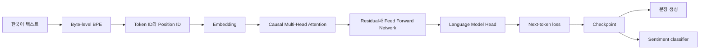
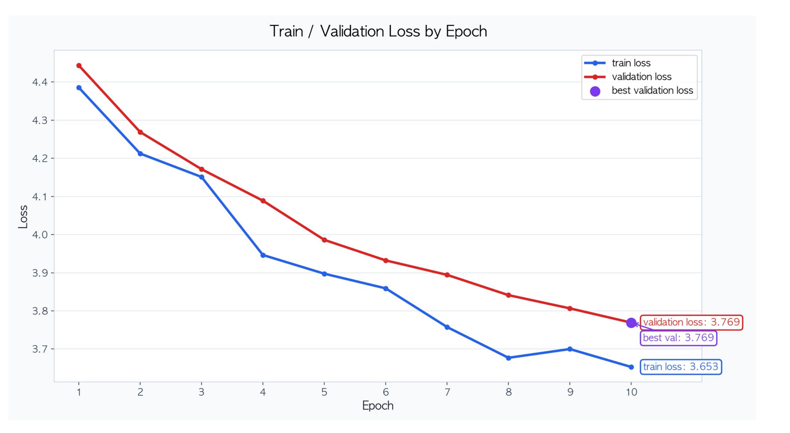

# LLM From Scratch Lab

한국어 텍스트를 토큰으로 나누는 단계부터 다음 토큰 예측, checkpoint와 문장 생성까지 연결한 교육용 소형 GPT입니다.

`Python` `PyTorch` `NumPy` `4인 팀 공동 구현`

[구현 구조](docs/architecture.md) | [실험 결과](docs/results.md) | [기여 기록](docs/contribution-map.md) | [출처와 재사용 범위](ATTRIBUTION.md)

## 시작한 이유

LLM API를 사용하는 것만으로는 모델 안에서 데이터가 어떻게 흐르는지 알기 어려웠습니다. 텍스트가 token ID가 되는 과정, attention이 미래 토큰을 가리는 이유, 학습한 모델이 다음 토큰을 고르는 과정을 코드로 직접 연결해 보고 싶었습니다.

먼저 NumPy로 layer의 forward와 backward, optimizer를 구현했습니다. 그다음 byte-level BPE, embedding, causal multi-head attention, Transformer block, 사전학습, 생성과 sentiment fine-tuning 도구까지 범위를 넓혔습니다.

## 구현 흐름



| 단계 | 구현 내용 | 위치 |
| --- | --- | --- |
| 신경망 기초 | Affine, ReLU, Softmax, BatchNorm, Dropout, cross entropy, SGD, Adam | `foundations/mnist_numpy/` |
| Tokenization | byte-level BPE 학습, encode와 decode | `gpt/src/bpe.py` |
| Embedding과 Attention | token과 position embedding, causal multi-head attention | `gpt/src/embeddings.py`, `gpt/src/attention.py` |
| GPT | LayerNorm, residual path, FFN, Transformer block와 LM head | `gpt/src/model.py` |
| 학습과 생성 | loss, optimizer step, checkpoint, temperature와 top-k generation | `gpt/src/train.py` |
| Fine-tuning | sentiment dataset, classifier head, train과 evaluate 도구 | `gpt/src/finetune.py` |

세부 tensor shape와 module boundary는 [구현 구조](docs/architecture.md)에 정리했습니다.

## 팀 결과와 개인 기여

원본 과제는 4명이 페어 프로그래밍으로 진행했습니다. BPE, embedding, attention과 GPT backbone은 팀 공동 구현이며 한 사람의 단독 결과로 표시하지 않습니다.

- GPT 원본: [`Soldbone/gpt-lab`](https://github.com/Soldbone/gpt-lab)
- NumPy와 MNIST 원본: [`devhyun05/group4-mnist-lab`](https://github.com/devhyun05/group4-mnist-lab)

이 저장소는 두 과제의 코드와 근거 자료를 이시원이 개인 검증용으로 다시 구성한 저장소입니다. Git author로 확인되는 개인 범위는 다음과 같습니다.

| 범위 | 확인되는 작업 |
| --- | --- |
| NumPy 기초 | ReLU, Softmax, Affine, loss, SGD, Adam, Dropout, BatchNorm과 network composition |
| GPT 학습 | batch loss, pretraining loop, checkpoint 저장과 복원 |
| 생성 | temperature와 top-k token generation, encode에서 decode까지의 sample 흐름 |
| Fine-tuning | sentiment dataset, classifier, train과 evaluate 도구 |
| 증적 | batch-size 실험과 독립 저장소 재현 자료 보존 |

개별 commit과 공동 구현 경계는 [기여 기록](docs/contribution-map.md)에서 확인할 수 있습니다.

## 대표 실험 결과

| 결과 | 값 | 근거 범위 |
| --- | --- | --- |
| 발표 기준 validation loss | 5.565 | 독립 저장소 README에 보존된 발표 기록 |
| 최종 validation loss | 3.769 | 여러 설정을 함께 바꾼 발표 기록 |
| batch 4 validation loss | 4.077299 | commit `4fe533e`의 원본 산출물 |
| batch 16 training time | 312.575초 | commit `4fe533e`의 원본 산출물 |
| 현재 CPU smoke loss | 4.308793에서 2.670516 | 같은 synthetic batch의 5-step 연결 검사 |



초기와 최종 결과는 layer, learning rate와 batch size가 함께 다릅니다. 특정 변수 하나의 효과로 해석할 수 없습니다. batch 비교만 원본 설정과 epoch별 지표를 보존했으며 나머지 비교는 발표 표와 이미지가 남아 있습니다.

표, provenance와 해석 한계는 [실험 결과](docs/results.md)에 분리했습니다.

## 현재 재현 방법

현재 환경에서는 전체 GPU 학습을 다시 돌리지 않습니다. 단위 테스트와 작은 CPU smoke로 코드가 연결되는지 확인합니다.

```bash
uv sync
uv run pytest -q
uv run python scripts/smoke_train.py --output artifacts/current/smoke-result.json
```

2026-08-22 baseline에서 54개 테스트가 통과했습니다. Matplotlib의 non-interactive canvas 경고 2개가 있었지만 실패는 없었습니다.

CPU smoke는 하나의 synthetic batch를 5 step 반복합니다. loss 감소는 optimizer 연결을 확인할 뿐 모델 품질이나 일반화 성능을 증명하지 않습니다.

같은 날 smoke를 다시 실행한 결과 날짜를 제외한 모든 field와 loss 값이 보존 JSON과 일치했습니다. script가 실행일을 기록하므로 기존 증적 파일은 바꾸지 않았습니다.

## 프로젝트 구조

```text
.
├── foundations/mnist_numpy/  # NumPy 신경망 기초
├── gpt/                      # BPE, GPT, 학습과 fine-tuning
├── scripts/smoke_train.py    # CPU 연결 검사
├── artifacts/current/        # 현재 smoke 결과
├── artifacts/pretraining/    # 원본 batch 실험
└── docs/                     # 구조, 결과와 기여 근거
```

## 한계와 출처

- 교육용 소형 GPT이며 범용 언어 모델의 품질을 목표로 하지 않습니다.
- layer, learning rate, dropout과 최종 실행에는 원본 지표 파일이 없습니다.
- batch 비교는 단일 seed와 단일 장비에서 실행했습니다.
- sample generation 표에는 encoding이 깨진 문자열이 있어 생성 품질 근거로 쓰지 않습니다.
- fine-tuning 코드와 단위 테스트는 있지만 검증 가능한 accuracy 산출물은 없습니다.
- 원본 팀 코드와 공개 동의, 재사용 범위는 [ATTRIBUTION.md](ATTRIBUTION.md)를 따릅니다.
