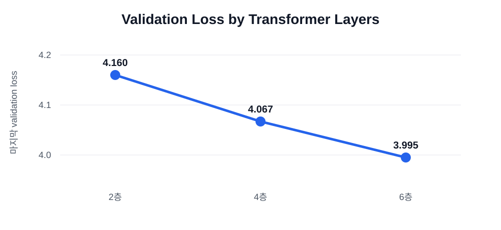
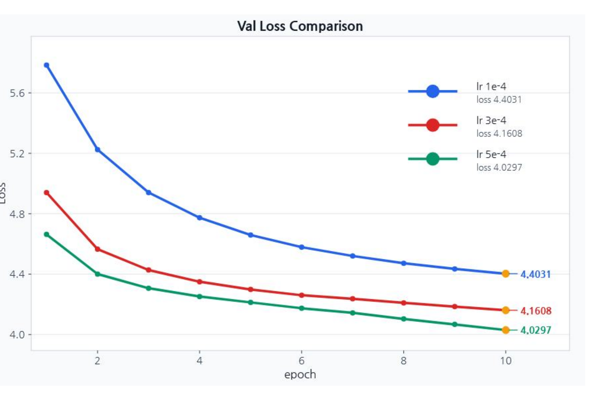
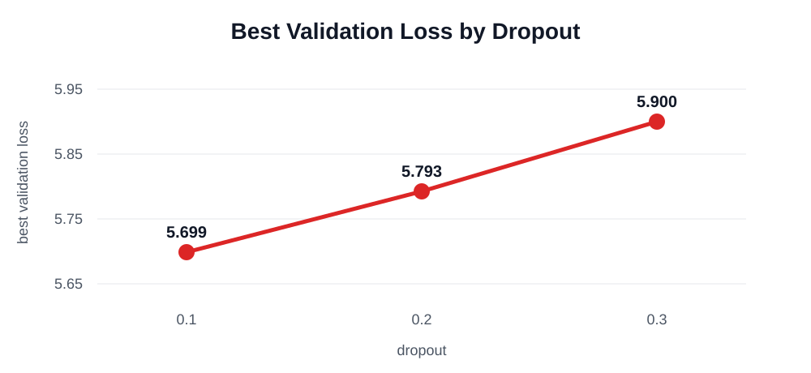

# 실험 결과

## 기준 실행

| 항목 | 값 |
| --- | ---: |
| vocabulary | 3,000 |
| context length | 128 |
| embedding dimension | 128 |
| Transformer layers | 2 |
| attention heads | 4 |
| learning rate | 3e-4 |
| batch size | 8 |
| dropout | 0.1 |
| epochs | 10 |

기준 실행은 train loss 5.278, validation loss 5.565, test loss 5.563을 기록했습니다.

## Transformer 층 수

| Layers | Validation loss |
| ---: | ---: |
| 2 | 4.160 |
| 4 | 4.067 |
| 6 | 3.995 |

6층에서 validation loss 3.995를 기록했습니다.



## Learning rate

| Learning rate | Validation loss |
| ---: | ---: |
| 1e-4 | 4.4031 |
| 3e-4 | 4.1608 |
| 5e-4 | 4.0297 |

5e-4에서 validation loss 4.0297을 기록했습니다.



## Batch size

[batch experiment source](https://github.com/Soldbone/gpt-lab/commit/4fe533e)

| Batch | Best val loss | Test loss | Test PPL | Test Top-1 | Training time |
| ---: | ---: | ---: | ---: | ---: | ---: |
| 4 | 4.077299 | 4.083347 | 59.343750 | 0.227214 | 714.121 s |
| 8 | 4.164609 | 4.173029 | 64.911758 | 0.217844 | 451.789 s |
| 16 | 4.223969 | 4.233643 | 68.968029 | 0.213138 | 312.575 s |

batch 4가 가장 낮은 validation loss를, batch 16이 가장 짧은 학습 시간을 기록했습니다.

- [Batch experiment dashboard](../artifacts/pretraining/batch_size_experiment_dashboard.png)
- [Validation loss comparison](../artifacts/pretraining/loss_comparison_val.png)
- [Raw summary table](../artifacts/pretraining/summary_by_batch_size.md)
- [Batch 4 metrics](../artifacts/pretraining/batch_4_metrics.json)
- [Batch 8 metrics](../artifacts/pretraining/batch_8_metrics.json)
- [Batch 16 metrics](../artifacts/pretraining/batch_16_metrics.json)

## Dropout

| Dropout | Best validation loss |
| ---: | ---: |
| 0.1 | 5.699 |
| 0.2 | 5.793 |
| 0.3 | 5.900 |

dropout 0.1에서 best validation loss 5.699를 기록했습니다.



## 최종 설정

| 항목 | 값 |
| --- | ---: |
| vocabulary | 3,000 |
| context length | 128 |
| embedding dimension | 128 |
| Transformer layers | 6 |
| attention heads | 4 |
| learning rate | 5e-4 |
| batch size | 4 |
| dropout | 0.1 |
| epochs | 10 |

최종 실행은 train loss 3.653, validation loss 3.769를 기록했습니다.


## NumPy baseline

784→512→256→10 network는 537,354 parameters로 MNIST test accuracy 98.44%를 기록했습니다.

## CPU smoke

현재 pipeline은 작은 GPT의 forward, next-token loss, backward와 AdamW update를 CPU에서 5 step 실행합니다.

```text
4.308793 -> 3.898402 -> 3.537956 -> 3.219144 -> 2.937734 -> 2.670516
```

54개 test와 CPU smoke 재실행이 통과했습니다.

## 실행

```bash
uv sync
uv run pytest -q
uv run python scripts/smoke_train.py --output artifacts/current/smoke-result.json
```
